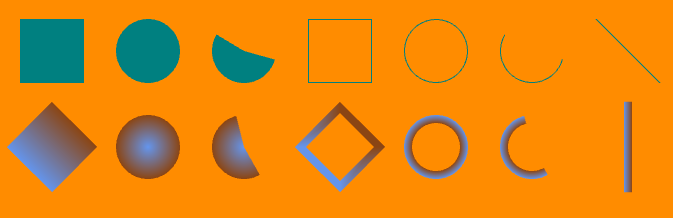
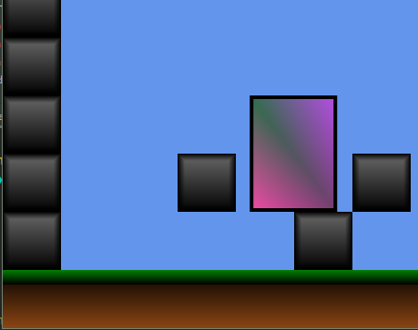

# Neo Granseal Engine
A framework and library for rapid prototyping and playing around.  
Currently, the core feature is rendering shapes on the gpu.

Highly experimental by nature,  
because it is my tool for learning Rust and Wgpu and having fun.

  
[Shape Example](https://github.com/RogueShadow/neo_granseal/blob/master/examples/shapes/main.rs)

I'm aiming for a simple and flexible api. Here is all you need to draw a box.
```rust
use neo_granseal::prelude::*;

fn main() {
    start(Box {},GransealGameConfig::new())
}

struct Box {}

impl NeoGransealEventHandler for Box {
    fn event(&mut self, core: &mut NGCore, event: Event) {
        match event {
            Event::Draw => {
                let mut g = ShapeGfx::new(core);
                g.rect(Point::new(128.0,128.0),Point::new(128.0,128.0));
                g.finish();
            }
            _ => {}
        }
    }
}
```

There is a MeshBuilder, to allow you to build simple dynamic elements  into one mesh, and draw it all at once.   
You can also build very complex meshes, and buffer them to the gpu for faster drawing.  
Entirely using vertex colors for the moment, it's rather nice I think.

  
Layer just a couple shapes and fades, and you can make some nice things to play with.  
This is a simple tilemap, with all tiles for the whole level made in one mesh, and buffered to the gpu.  
Buffer your static items, and use the meshbuilder for dynamic shapes.

### Features
* Entirely GPU rendered shapes
* Simple mesh building, with vertex colors
* All CSS Color codes built in as constants.
* Can add your own rendering pipelines.
* Simple Camera
* Collision detection for axis aligned rects
* Raycasting for axis aligned rects

### Plans
* Very much in the air. 
* Playing sounds
* Drawing images
* beziers
* text rendering